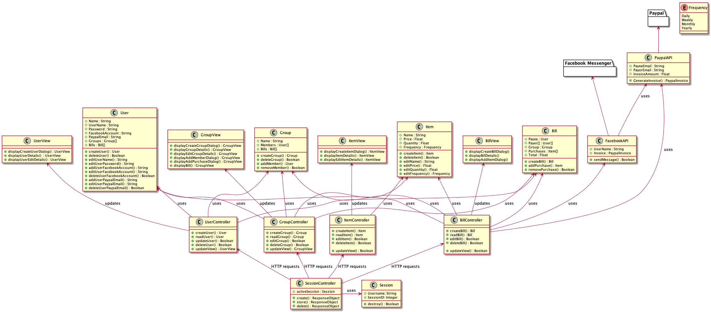
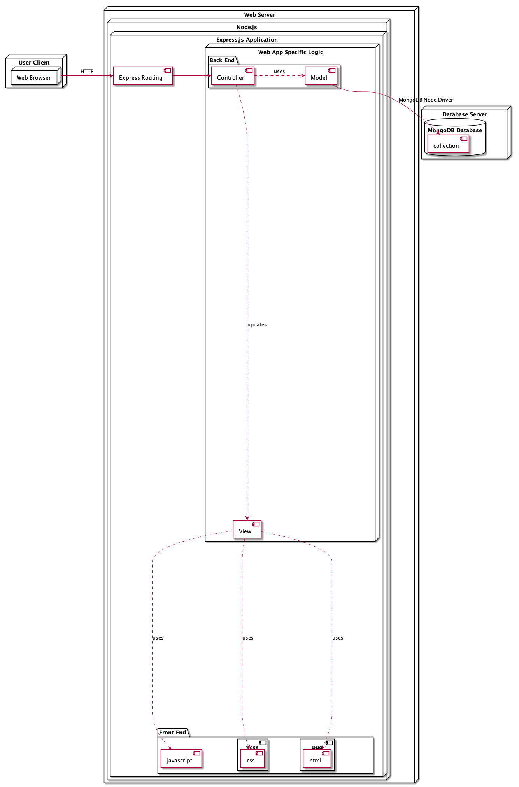
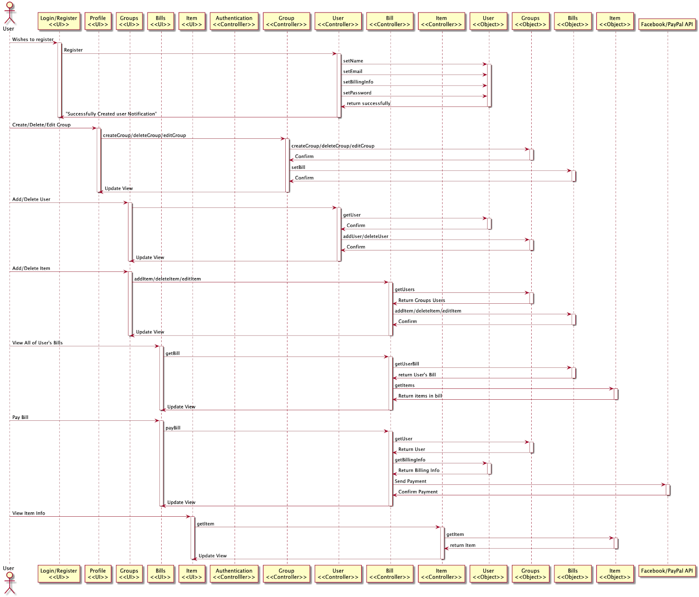

# Detailed Design Document 

### Class Diagram

#### Group
The group class simply has one unique attribute, which is the group name. However, the group class has two dependencies, being the bills and the users. This is because the group class is essentially a group of users and a list of bills that pertain to the group.  The associated methods with this class are simply CRUD methods for each variable and dependency.

#### User
The user class is responsible for keeping track of all of the information associated with each user. This includes the name, username, password, facebook account and paypal email. It also has dependencies with groups and bills, as each group will have a collection of users, and each bill will have associated users. The associated methods with this class are simply CRUD methods for each variable and dependency.

#### Bill
The bill class simply has one unique attribute, which is the sum total of all of the items. However, it has dependencies with each of the other 3 classes. Each user in the group will receive a bill for their unpaid items at the end of a given time period. Therefore, each bill will be attributed to a single user. If a user is part of multiple groups, they may receive multiple bills within the given time period. Since each bill is the sum total of all their unpaid items, each bill may have multiple items associated with it. The associated methods with this class are simply CRUD methods for each variable and dependency.

##### Item
The item class is responsible for keeping track of all the relevant information that pertains to each item purchased. This includes the item’s name, it’s cost (price), how many of them were purchased (quantity), and a purchase frequency if it is a recurring payment. The associated methods with this class are simply set/get methods for each variable and dependency.

#### PaypalAPI
The PayPal API is responsible for interacting with the PayPal API and is used to generate PayPal invoices that are sent to users via Facebook messenger.

#### FacebookAPI
The Facebook API sends invoices generated by PayPal to the user who owes the given value on that invoice.

### Deployment Diagram

BillSplit is a Node.js based app with a MongoDB. It uses Express.js for routing, and PUG and SCSS for front-end styling and HTML generation.

### Behaviour Diagram

#### Login/Register View
The login register page will be the first page that the user will be directed to upon reaching the site. It will have an option to enter user credentials to login or to create a new user profile.

#### Profile View
The user profile will be the main page of the site, it will show options to view any group they are in, create a new group, delete, or edit any groups that they own. The page will request for all groups associated with the user’s profile.

#### Groups View
The groups view will show any information about a specific group. The view will give options to the user or owner of the group to add delete, or edit any items in the groups bill.

#### Item View
This view is used to view singular items and the information about them.

#### New User Controller
Upon registering, this controller will validate that there is no users with the same name in the model and pass the new user info to the user model.

#### Groups Controller
The responsibilities of this controller will be to authenticate that only group members are able to see or manipulate the requested group info. After authentication the controller will retrieve the information from the group model. Will be processed by the model.

#### User Controller
The user controller will be responsible for all requests related to users of the system. It will confirm that only the owner of the user profile will be able to see the private information on that profile.

#### Bill Controller
This controller is used to authenticate bills so that there is no is no duplication of bill made inside of a group. It is also responsible for allowing only the correct users to view their corresponding bill.

#### Item Controller
The responsibilities of this controller is to access items from the item controller and only show people who are the payee or the payer of that item.

#### User Model
The user model gives access to any information about the user. Information regarding their name, email, facebook url, payment information and password is accessed through here.

#### Group Model
Information about the group such as its name and members are accessed through this model.

#### Bill Model
Information regarding group payee, payer, and item list are accessed through this model.

#### Item Model
The item model gives access to the name, frequency of occurrence, price and quantity.

#### Facebook API
This model is used to send messages and PayPal payments over.

#### PayPal API
This model is used to generate PayPal invoices to be sent users who owe money.

### Architecture Decision Records

#### Facebook API
**_Status:_** _Accepted_
**Context:** The need to send message/notifications to users is a crucial requirement. Facebook was chosen because it is widely used among our target age demographic and has a well documented API.
**Alternatives:** Email.
**Decision:** Many people do not check email as often as social mesia, so our app will use Facebook API to send messages.
**Consequences:** The work required to create a messaging service will be minimized, as the Facebook API will do the bulk of the job. The app will now be limited to people who have Facebook accounts. Facebook will provide a familiar and easy to use interface for most users

#### PayPal API
**_Status:_** _Accepted_
**Context:** Our app must be able to send invoices so that users can send money requests after making purchases. PayPal was chosen because it is widely used, has a well documented API and can take payment from multiple common payment methods, such as credit card, visa debit,  PayPal balance, or it can withdraw directly from the user’s bank account.
**Alternatives:** Venmo, Interac, No automatic billing.
**Decision:** Venmo is not available in Canada. The Interac API is new and documentation is minimal. Our app will use PayPal to create invoices.
**Consequences:** The work required to create a billing service will be minimized, as the PayPal API will do the bulk of the job
Users will be subject to PayPal fees
Although PayPal supports many common payment methods, it still lacks support for some, potentially making it difficult for some users to receive or pay invoices
PayPal will provide a familiar and easy to use interface for most users

#### Sassy CSS (SCSS)
**_Status:_** _Accepted_
**Context:** As a web app, it is very important to have a consistent and modern UI, in order to satisfy usability requirement.
**Alternatives:** SASS, Bootstrap, plain CSS.
**Decision:** SCSS is the best documented technology, and one of our team members has co-op experience with it, so our team will use SCSS to generate CSS for application styling.
**Consequences:** The work required to create the styles will be reduced
Members of the team who are not familiar with SCSS must spend time learning it
The styling of the app will be limited to the SCSS styles
Sassy CSS will be easier to modify and maintain than regular CSS

#### Object-Oriented Structure
**_Status:_** _Accepted_
**Context:** Object-oriented web applications are the modern standard, making  it is easy to find support, documentation and case studies.
**Alternatives:**  Functional programming.
**Decision:** OOP is the standard for web design, thus our app will consist of 4 classes: Group, User, Bill and Item for an OOP approach.
**Consequences:** Separating these four classes will avoid excessive repetition in the database. Having the clear modular structure that comes with OOP will allow for easier maintenance and scalability of the software. Limited repetition in the database will shorten the costly update and write commands that typically come with a NOSQL approach.

#### AJAX
**_Status:_** _Accepted_
**Context:** Our application needs to be fast and responsive to satisfy our architecturally significant requirement of responsiveness. Using AJAX will be a simple way to accomplish this.
**Alternatives:**  WebSocket, RESTFul API.
**Decision:** AJAX programming will be used to fetch and send data between the server and client, as none of our team member have experience with WEbsocket or RESTful APIs.
**Consequences:** Pages may be updated without reloading the entire page. Users will experience minimal waiting time after sending or requesting data

#### Pug
**_Status:_** _Accepted_
**Context:** The team needs to be able to make simple, clean and fast HTML templates for the app.
**Alternatives:** Mustache.js, plain HTML.
**Decision:** All three team members have experience with PUG, which can produce code much faster than plain HTML. PUG will be used as the templating language.
**Consequences:** Less time will be spent on the front end, compared to simply using basic HTML. Our templating engine will integrate easily with Node.js.
