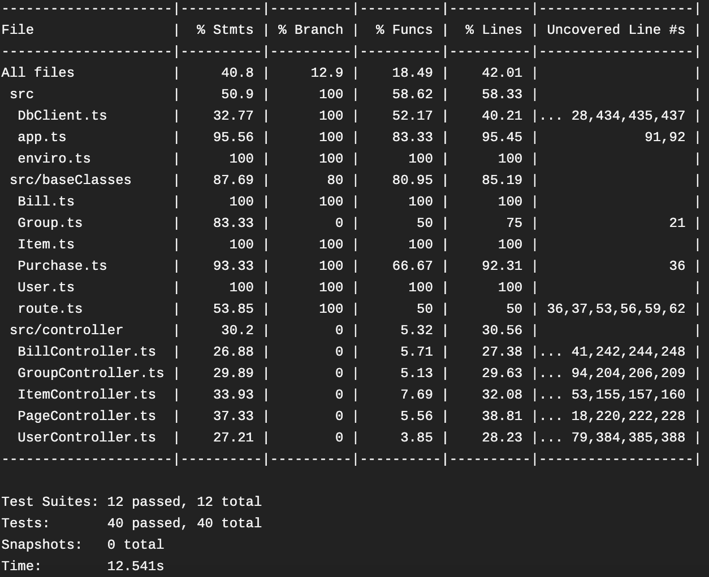
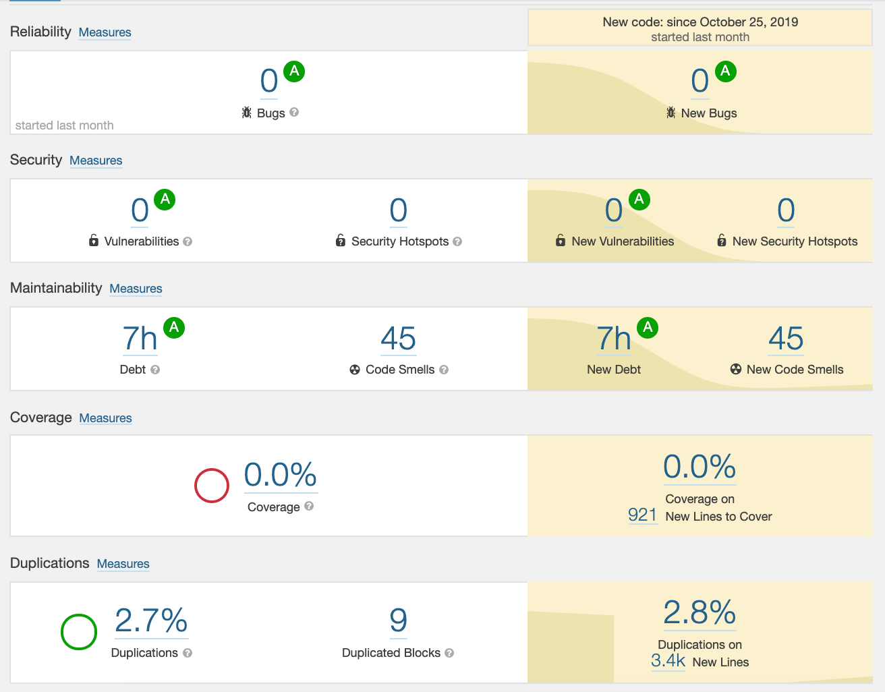
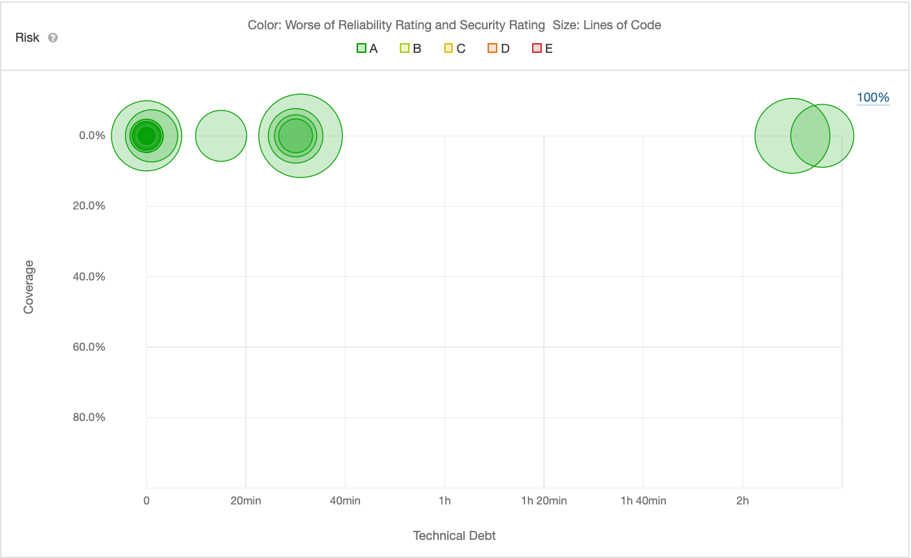

# Milestone 4 - Progress Report

## Progress Overview

For this milestone we completed all of our user stories, satisfied all of our quality attribute scenarios, added some more tests and were able to successfully containerize the app and put it on Dockerhub.

## User Stories
For for the final milestone we were able to complete all remaining user stories for our app. Please see the "User Story How-To" section below, to see a step-by-step guide on how to complete each of our user stories on the app.

###  User Story How-To
Although creating an account and logging in are not proper user stories, they are necessary in order to complete all our other user stories. Please see user stories 0 and 0.5 to learn how to create an account and login respectively.  User stories 1-7 will assume that user stories 0 and 0.5 have been completed.

#### 0) As a user I want to create an account
  1. Navigate to the app via localhost, Heroku or Docker
  2. Select "Sign-Up"
  3. Fill out the name, username, email, password and password confirmation sections
  4. Click the green "register" button

#### 0.5) As a user I want to be able to login to my account
  1. Complete user story 0 if you haven't already
  2. Click the green "Login" button
  3. Enter the email and password information you provided when making an account
  4. Click the green "Sign in" button

#### 1) As a user I want to add items I’ve purchased, their corresponding costs, and the frequencies at which I purchase them
  1. Click "purchases" on the navbar and then click the "add a purchase" option
  2. Click the green "create item"
  3. While in the pop-up menu, fill out out the item name, price, and click "add"
  4. Search for the item by name in the "item" searchbar
  5. Add the quantity
  6. Select the frequency
  7. Select the billing group
  8. Click the green "Add to Group's Bill" button

#### 2) As a user I want to join and leave billing groups

##### 2.0) Creating a group
  1. Click "Groups" on the navbar and then click the "Create a Group" option
  2. Enter the group name and members
  3. Click the green "add" button

##### 2.1) Joining a group
  1. Click "Groups" on the navbar and then click the "Join a Group" option
  2. Search for your group by name (assumes a group has already been created) and select it when it appears
  3. Click the green "Join group" option

##### 2.2) Leaving a group
  1. Click "Groups" on the navbar and then click the "View Groups" option
  2. Click the group you would like to leave (assumes you are already in a group)
  3. Click the green "leave group" button

#### 3) As a user, I want to be able to accept or decline items added to a group I am a member of
  1. Click the "profile" option in in top right of then screen and then select "notifcations" to see if an item has been added
  to your bill
  2. If an item has been aded to your group by another user, you can either select the green "accept" or red "decline" button   to accept or decline the item respectively

#### 4) As a user I want to see a bill at a specified time interval that covers all item costs I owe to other users in the group
##### 4.1) To see a new bill
  1. Click on "Bills" in the navbar and then select the "Pay Bills" option to see the total cost you currently owe to the group for new bills (bills that are due)

##### 4.1) To see an old bill
 1. Click on "Bills" in the navbar and then select the "View Bills" option to see the bill dates and totals for all your old bills

#### 5) As a user I want to be notified about and notify others of bills that are owed in my group(s)
  1. On the home page, scroll down to the "Upcoming Bills" list on the bottom left
  2. This list will automaticaly update and show each person what they will owe (or what thy will receive) on their next bills for each group

#### 6) As a user I want to view my billing metrics, including amount owed and payment history
This user story has been split into 2 parts: seeing the amount owed and seeing payment history

##### 6.1) Seeing Amount Owed
  1. Go to the home page
  2. See the "spending forecast chart" and hover over the current date
  OR
  1. Click on "Bills" in the navbar and then select the "Pay Bills" option to see all your current bills

##### 6.2) Seeing Payment History
  1. Click on "Bills" in the navbar and then select the "View Bills" option to see all your past bills

#### 7) As a user who is a member of a group, I want to view that group's billing metrics such as the spending of all members
  1.  Click on "Groups" in the navbar and the "View Groups" option.
  2.  Click on the desired group
  3. Navigate to the bottom of the page to the "Recent Purchases" section to see the all the spending within the group by each member

## Quality Attribute Scenarios

As required by this milestone, we have fufilled all 7 of our QAS and have automated the testing for 4 (the 3
required +1 bonus) of the QAS within our CI Pipeline.

### QAS Automatically Tested Within the CI Pipeline
#### 1) Testability
In order to fufill the testability aspect of our project, we had Travis run every test upon each push to the repository
and had it generate a code coverage report. Although we were unable to meet our initial goal of 75% code coverage, some of
the most important aspects, such as the functionality of the base classes had very high coverage. Moreover, every part of our
code (classes, controllers, the database and the routes) were covered within the tests.

#### 2) Responsiveness
In order to test the responsiveness of our code, some of our tests had a timeout limit. Although Jest has a default timeout
limit, we decreased this limit for some of our integration tests. In particular, the integration tests for adding an item
to the database and checking if it's there, and adding a user to the database and ensuring it's there both have a timeout limit of 2 seconds or less. Because these performance tests are run within Travis and Travis only passes if no the tests fail, we have ensured that we have automated responsiveness testing.

#### 3) Modifiability
In order to satisfy our modifiability QAS, we decided to implement TSLint to ensure that our code follows best practices. Upon
each commit, Travis will run the linter and will only pass if the linter does not find any errors. This ensures that the code
remains clean and readable. Since the linter is run within Travis and since Travis will fail if the linter does not pass,
testing for modifiability has been automated within our CI pipeline.

#### 4) Availability
As we learnt in our labs, containerizing your project increases availability because it allows for it to be hosted from
virtually anywhere. If all of our tests pass and the linter does not find any errors, we have configured Travis to containerize our app using Docker and upload it to DockerHub. The app will only be uploaded to DockerHub if all the tests pass, the linter doesn't find any errors, and there are no errors while building the container itself. Because this has been automated in Travis, and will fail if any of the previous steps fail, the availability QAS has been tested for within our CI pipeline.

### Other QAS Fufilled
#### 1) Scalability
As discussed within our lab, Node and MongoDB are highly scalable tools. Node is a single threaded and asynchronous web framework, which can allow for very high performing apps. Examples of this can be seen within the many large companies and organizations that use Node.js, which include PayPal, NASA, Uber and more.  However, it should be noted that this is only the case if the proper programming techniques have been implemented, such as the use of async, wait and then commands. Since many aspects of our app have been created using asynchronous programming, we can ensure that the app will likely scale well. Likewise, the database we used (MongoDB) is also highly scalable and is used by many large companies like eBay, Facebook and SAP. Arguably the attribute of MongoDB that makes it so scalable is the fact that it is NoSQL. NoSQL databases are typically very fast for querying since they do not follow the relationship model. This makes it very scalable for most modern day web apps which typically query much more than they create, update or delete.

##### 2) Usability
Usability was one of the most difficult QAS to test, since much like other QAS it is inherently difficult to quantify. From the outset of this project, our mentality has been to copy the look and feel of other modern web apps in order to limit the learning curve. This was primarily done through our heavy use of the Bootstrap. Bootstrap is a very commonly used frontend framework for building web applications, and is used by companies like Spotify and Twitter. By using the built in features of Bootstrap like buttons and navbars, we were able to make our app have a modern, intuitive and easy to use interface. We tested this by giving the app to our non-technical friends and family members, and having them complete some of our use cases. Everyone that we gave the app to was able to complete each use cases within a matter of minutes or even seconds with our, even though they had never used the app before. Because our front-end emulates other common web apps and our user group did not struggle to use the app, we can assure that our app is indeed very usable.

#### 3) Integrity and Security
Being an application that deals with money and payment information, it is important that we prioritize the integrity and security of the user’s data to ensure security to the user. Within our original QAS we outlined the importance that only users themselves should be able to see their own private data. The first way in which we achieved this is to pass security tokens when a user logs in. This ensures that malicious users would not be able to bypass the login process by manipulating the url. Moreover, the deployed version of the app is hosted on Heroku, which uses HTTPS. HTTPS is the more secure version of regular HTTP, and can ensure that users connect to the proper website when going to our URL. This is crucial because we do not want users entering their billing and personal information on a malicious website. Moreover, all data sent over an HTTPS connection is encrypted, which would make it even harder for data to be comprised. Lastly, since MongoDB is a NoSQL database, extra time, effort and precautions went in to ensuring that data is properly dealt with when it is created or updated. Because this is so hard to test, we primarily tested this manually be creating and deleting dummy data, and checking to ensure it had properly been deleted. Because login tokens are passed throughout pages, the app is hosted via HTTPS and we have tested that our data is consistent, we can rest assured that our app has the necessary integrity and security measures (at least within the scope of this course).

## Docker

Although Docker was not required and was just for bonus marks, it was very important for us to containerize our app, because it allowed for us to run and test the app very easily, and helped satisfy our availability QAS. Although we had this process mostly done for the last milestone, there were still some errors that needed to be fixed (namely connecting to the database).
We fixed this by creating two separate images, one for the app and one for the database. This required creating a docker-compose file to go along with our Dockerfile. Moreover, our containerization process has been entirely automated with Travis. Upon each new commit, Travis will run all the tests, run the linter and if successful will containerize the app using Docker. If all of this is successful, it will log into our DockerHub account and will push the latest image to DockerHub.

### Running our Docker Container
To run our Docker container, one must first clone our git repository. Once the repository has been cloned, simply navigate to the BillSplit folder in the terminal. While in the BillSplit folder of the project, launch Docker desktop and run "docker pull billsplitapp/app" in the terminal. Then run "docker-compose up --build" and wait for the app and mongo containers to start running. Once they have started running, open a web browser and go to "http://localhost:3000/" to use the app.

## Testing, Travis, Linting and Code Coverage
As mentioned previously within our report, we have configured Travis to automate the testing and deployment of our project. A successful Travis build will run and pass all of our tests in the Travis virtual machine, generate and display a code coverage report, have no lint errors (using TSLint), build a Docker container, and will push the Docker container to DockerHub (if the rest of the tasks succeed).

For testing we created both unit tests and integration tests, which cover at least a portion, if not most of every main component of our app (classes, controllers, the database and the routes). TS-Jest unit tests were primarily used to tests the basic functionality of our classes, and TS-Jest and Supertest were used in conjunction to create integration tests that tested the controllers, routes and database. These tests were very useful because everytime a new commit was made that broke something, our tests caught it and prevented us from deploying broken code.

### Coverage Report
A recent coverage report generated by Jest in Travis:

## Static Analysis

## Change Log
### Bill Payments and Due Dates
We initially intended to allow users to set a unique bill due date and frequency for their group but elected instead to set bills to automatically release at the end of each month. This was done to promote simplicity in the database, as bll payments are tracked using an object indexed by year that contains a month-indexed array of the users who have paid for the month. Then, when we load the bills that are due in the pay bills page, we check the payment history for each bill ahead of time to determine if it should be shown or not. This also allows us to retain the structure of all previous bills (no deletion necessary when a bill is paid) so they can be used for analytics. 

### Heroku
Billsplit is now live and available at https://billsplittt.herokuapp.com/. This will allow us to expand to use the Facebook API for bill notifications in the future. 

### Graphs
We changed how the bar graph looked from the time of the demo to show the full scale of the graph. The forecasting of the graph was also changed to show the frequency more accurately. 

### Notifications
There are now more notifications to show who has declined a bill in the group.

### User Stories Changes
Average spent per month statistic was removed from user story 6.

### Quality Attribute Scenarios Changes
Because many of the tests and metrics previously outlined for our  QAS were unrealistic within the scope of this project, they have been modified to suit the scope BillSplit.  Please see the "Quality Attribute Scenarios" section in this document to see how we satisfied our modified quality attributes.
