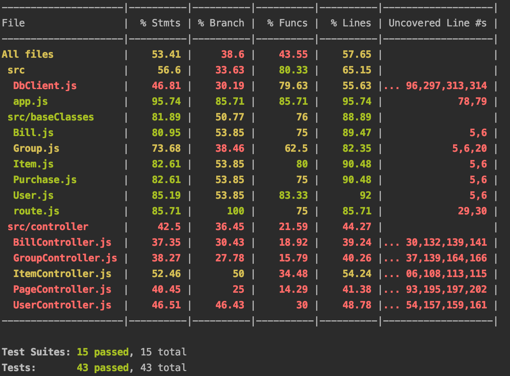
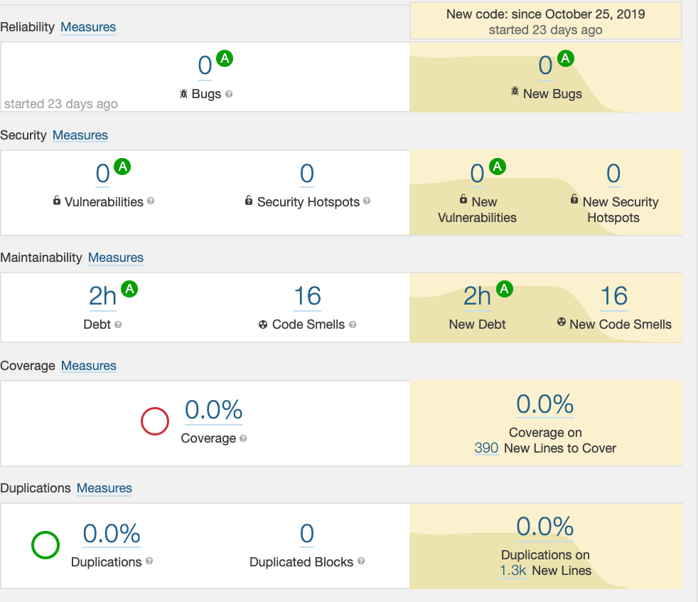
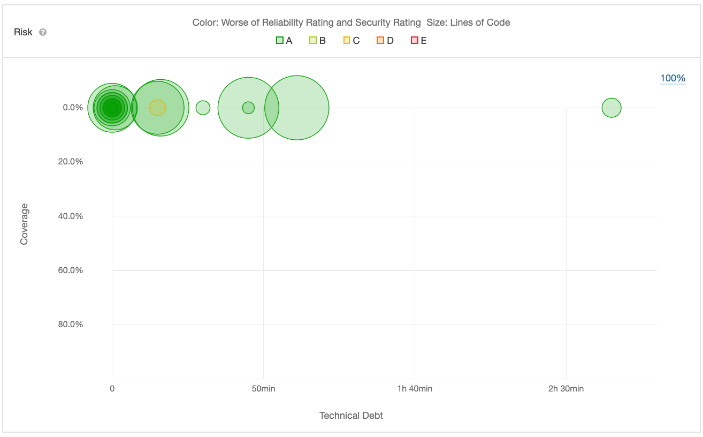

# Milestone 3.5 - Progress Report
## Progress Overview
This milestone's progress was primarily made in our group and bill functionality. From [Milestone 3's](https://github.com/seng350/seng350f19-project-3-10/blob/master/Documentation/Milestone3.md) user stories, we have now completed user story 2. We have also completed the back end and database work necessary for user stories 6 & 7 by having the functionality in place to pull up a user or group's purchases and bills. We now need to complete our group home page and our view user purchases page front end to display these objects. We also made significant progress towards user story 5 with our deployment to heroku.

## Docker
For this milestone we began containerization process with Docker. This was done by creating a Dockerfile and a
docker-compose.yml file. The containerization process has now all been automated by Travis, and at the end of each
successful build the containerized app gets uploaded to Dockerhub. The app can be run in the Docker container by doing a
"docker pull" of the branch, and a "docker-compose up -d mongo" to begin running the database, and then finally a
"docker-compose up app" to begin running the app. Although this process is almost complete, there are some problems with the
containerized app connecting to the database. The goal is to have these issues resolved for milestone 4.

Our Dockerhub branch: https://hub.docker.com/r/billsplitapp/app

## Testing
The testing process for this milestone was more of the same. TS-Jest and Supertest were used to create the basic unit tests
and the integration tests. More tests were added to test the database and the new controllers.

The coverage report can be seen below:

## Travis
One of the main issues with our last milestone was that the Travis builds would not pass. This has been fixed by correcting
the tests to run properly in Travis. As mentioned earlier in this report, Travis has also been configured to containerize the app
and upload it to Dockerhub.

## Heroku
To make progress on sending notifications to users, we have decided to use facebook to do so. In setting up the facebook API, we needed a URL. We chose Heroku to accomplish this. Our website can be found at [BillSplit](https://billsplittt.herokuapp.com/)

## Static analysis
From our last milestone there was a lot of improvement from using SonarQube and Bettercodehub. A lot of it had to do with learning more about how to use the tools and what they were looking for.

